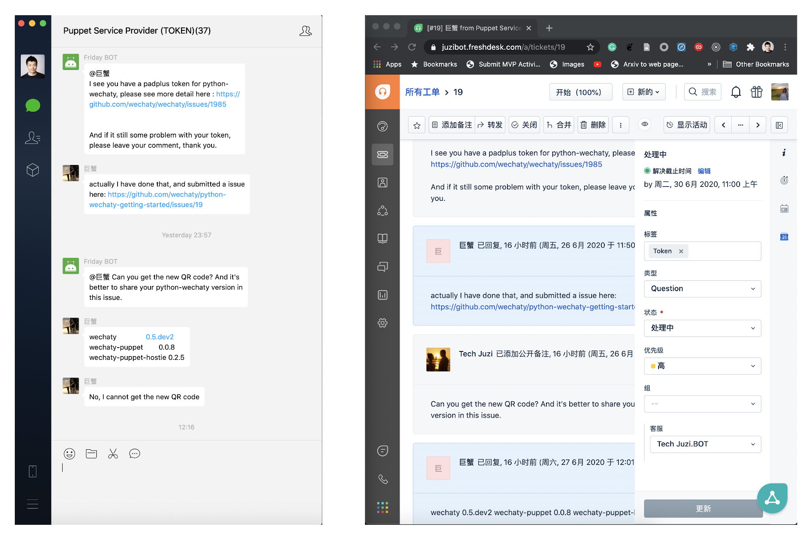

# wechaty-plugin-freshdesk

[](https://www.npmjs.com/package/wechaty-plugin-freshdesk)
[](https://github.com/wechaty/wechaty-plugin-freshdesk/actions?query=workflow%3ANPM)

Freshdesk is a cloud-based helpdesk system that offers powerful solutions for customer service.

Wechaty Freshdesk Plugin helps Freshdesk unifies conversations from WeChat, and helps you resolve issues across channels effortlessly!


[](https://github.com/wechaty/wechaty-plugin-freshdesk)
[](https://github.com/Wechaty/wechaty)
[](https://www.typescriptlang.org/)

## Introduction

Wechaty Freshdesk Plugin helps you to manage your customers/leads/users in the WeChat Room, with the power of the Freshdesk service.

## Usage

```ts
import { WechatyFreshdesk } from 'wechaty-plugin-freshdesk'

const config = {
  room: 'room_id@chatroom',

  at              : true,
  webhookProxyUrl : 'https://smee.io/your_smee_io_proxy_url',
  apiKey          : 'your_freshdesk_api_key',
  portalUrl       : 'https://your_portal_name.freshdesk.com',
}

const FreshdeskPlugin = WechatyFreshdesk(config)

const wechaty = new Wechaty()
wechaty.use(FreshdeskPlugin)
```

1. `config.room`: The room id of your service WeChat room.
1. `config.at`: If set to `true`, customers need to use `@` to mention the bot when they want to ask questions.
1. `config.webhookProxyUrl`: A `semee.io` link that you need to set it to receive the Freshdesk Webhook events.
    1. [smee.io - Webhook payload delivery service](https://smee.io/) - Receives payloads then sends them to your locally running application.
1. `config.apiKey`: The API Key for your Freshdesk account.
    1. [Freshdesk API - How to find your API key](https://support.freshdesk.com/support/solutions/articles/215517-how-to-find-your-api-key)

## Configure Freshdesk Webhooks

In order to receive the reply and close events from Freshdesk, we need to configure two webhooks:

To Be Added ...

The `request endpoint URL` must be as same as the `webhookProxyUrl` setting in the `config`.

See: [Using Webhooks in automation rules that run on ticket updates](https://support.freshdesk.com/support/solutions/articles/132589-using-webhooks-in-automation-rules-that-run-on-ticket-updates)

## Environment Variables

The following two environment variables will be used if the required information is not provided by the config.

### 1 `WECHATY_PLUGIN_FRESHDESK_PORTAL_URL`

`process.env.WECHATY_PLUGIN_FRESHDESK_PORTAL_URL` will be used if the `config.portalUrl` is not provided.

### 2 `WECHATY_PLUGIN_FRESHDESK_API_KEY`

`process.env.WECHATY_PLUGIN_FRESHDESK_API_KEY` will be used if the `config.apiKey` is not provided.

Learn more about the authorization token of freshdesk: [Freshdesk API - How to find your API key](https://support.freshdesk.com/support/solutions/articles/215517-how-to-find-your-api-key)

### 3 `WECHATY_PLUGIN_FRESHDESK_WEBHOOK_PROXY_URL`

We receive webhook payloads with the help from <smee.io>, by proxy them to our locally running Wechaty Plugin application.

`process.env.WECHATY_PLUGIN_FRESHDESK_WEBHOOK_PROXY_URL` will be used if the `config.webhookProxyUrl` is not provided.

See:

1. [smee.io - Webhook payload delivery service](https://smee.io/) - Receives payloads then sends them to your locally running application.

## Screenshot



## Example

Our Friday BOT are using `wechaty-plugin-freshdesk` to connect our WeChat customers to Freshdesk.

You can read the source code from: <https://github.com/wechaty/friday/blob/master/src/plugins/freshdesk.ts>

## See Also

1. [WhatsApp Integration in Freshdesk](https://support.freshdesk.com/support/solutions/articles/238137-whatsapp-integration)
1. [Freshdesk Integration in Freshdesk](https://support.freshchat.com/support/solutions/articles/50000000131-freshdesk-integration)

## History

### master

### v0.2 (Jun 26, 2020)

1. Init code base
1. Room message to Freshdesk
1. Freshdesk message to Room (Powered by Smee.io)

## Contributors

[](https://sourcerer.io/fame/huan/wechaty/wechaty-plugin-freshdesk/links/0)
[](https://sourcerer.io/fame/huan/wechaty/wechaty-plugin-freshdesk/links/1)
[](https://sourcerer.io/fame/huan/wechaty/wechaty-plugin-freshdesk/links/2)
[](https://sourcerer.io/fame/huan/wechaty/wechaty-plugin-freshdesk/links/3)
[](https://sourcerer.io/fame/huan/wechaty/wechaty-plugin-freshdesk/links/4)
[](https://sourcerer.io/fame/huan/wechaty/wechaty-plugin-freshdesk/links/5)
[](https://sourcerer.io/fame/huan/wechaty/wechaty-plugin-freshdesk/links/6)
[](https://sourcerer.io/fame/huan/wechaty/wechaty-plugin-freshdesk/links/7)

## Author

[Huan LI](https://github.com/huan) ([李卓桓](http://linkedin.com/in/zixia)),
Tencent TVP of Chatbot, \<zixia@zixia.net\>

[](https://stackexchange.com/users/265499)

## Copyright & License

* Code & Docs © 2020 Huan LI \<zixia@zixia.net\>
* Code released under the Apache-2.0 License
* Docs released under Creative Commons
