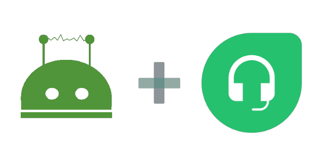

# wechaty-freshdesk

[](https://www.npmjs.com/package/wechaty-freshdesk)
[](https://github.com/wechaty/wechaty-freshdesk/actions?query=workflow%3ANPM)

[Freshdesk](https://freshdesk.com) is a cloud-based helpdesk system that offers powerful solutions for customer service.

Wechaty Freshdesk Plugin helps Freshdesk unifies conversations from WeChat, and helps you resolve issues across channels effortlessly!



[](https://github.com/wechaty/wechaty-freshdesk)
[](https://github.com/Wechaty/wechaty)
[](https://www.typescriptlang.org/)

## Introduction

Wechaty Freshdesk Plugin helps you to manage your customers/leads/users in the WeChat Room, with the power of the Freshdesk service.

## Requirements

1. Wechaty v0.40+
1. Freshdesk [Garden Plan](https://freshdesk.com/pricing)+ (for [Assuming identities](https://support.freshdesk.com/support/solutions/articles/224634-assuming-identities) support)
1. Freshdesk config
    1. Create two custom ticket fields
    1. Create Webhook

## Usage

```ts
import { WechatyFreshdesk } from 'wechaty-freshdesk'

const config = {
  contact: true,              // enable direct message.
  room: 'room_id@chatroom',   // enable a specific room. `true` for enable all room

  mention         : true,
  webhookProxyUrl : 'https://smee.io/your_smee_io_proxy_url',
  apiKey          : 'your_freshdesk_api_key',
  portalUrl       : 'https://your_portal_name.freshdesk.com',
}

const FreshdeskPlugin = WechatyFreshdesk(config)

const wechaty = new Wechaty()
wechaty.use(FreshdeskPlugin)
```

1. `config.contact`: Whether to allow direct message to be sync with ticket reply. `false` to deny all, `true` for allow all; Supports contact id(`string`) and contact name(`RegExp`). You can also mix them in array.
1. `config.room`: The room id of your service WeChat room.
1. `config.mention`: If set to `true`, customers need to use `@` to mention the bot when they want to ask questions.
1. `config.webhookProxyUrl`: A `smee.io` link that you need to set it to receive the Freshdesk Webhook events.
    1. [smee.io - Webhook payload delivery service](https://smee.io/) - Receives payloads then sends them to your locally running application.
1. `config.apiKey`: The API Key for your Freshdesk account.
    1. [Freshdesk API - How to find your API key](https://support.freshdesk.com/support/solutions/articles/215517-how-to-find-your-api-key)

## Configure Freshdesk Webhooks

In order to receive the reply and close events from Freshdesk, we need to configure the Freshdesk platform:

1. Add two custom ticket fields
1. Add a automation rule for Webhook

> Note: Freshdesk Garden Plan (or above) is required, because we need [Assuming identities](https://support.freshdesk.com/support/solutions/articles/224634-assuming-identities) feature.

### 1 Add Two Custom Ticket Field

1. Login to your Freshdesk agent account, from the menu on the left, select `Admin`, then select `Ticket Fields` under the `General Settings`.
1. Create two `Single-line text` fields:
    1. `Wechaty Room`
    1. `Wechaty Contact`


Doc: [Creating custom fields in your ticket form](https://support.freshdesk.com/support/solutions/articles/37596-creating-custom-fields-in-your-ticket-form)

### 2 Go to Automation Setting Page

1. Login to your Freshdesk agent account, from the menu on the left, select `Admin`, then select `Automations`.
1. Below the `Rules that run on`, there will be three selections: `Ticket Creation`, `Time Triggers`, and `Ticket Updates`.

### 3 Create a `Ticket Updates` Rule


1. Select `Ticket Updates`, click the `New rule` button.
1. Configure the rule as the following summary:
    1. When `Ticket is updated`
    1. When `an action performed by Agent`
    1. When `public Note is Added`  
        OR  
        `When Reply is Sent`
    1. `Trigger Webhook Method` - POST Url: <https://smee.io/your_smee_io_proxy_url>

And make sure you have configured the Webhook Content as the following:


1. `Ticket ID {{ticket.id}}`
1. `Last Public Comment {{ticket.latest_public_comment}}`
1. `Wechaty Room {{ticket.cf_wechaty_room}}`
1. `Wechaty Contact {{ticket.cf_wechaty_contact}}`

Then click `Preview and save`.

> Note: the `POST Url` must be as same as the `webhookProxyUrl` setting in the `config`.

See:

1. [Using Webhooks in automation rules that run on ticket updates](https://support.freshdesk.com/support/solutions/articles/132589-using-webhooks-in-automation-rules-that-run-on-ticket-updates)
1. [Setting up automation rules to run on 'Ticket Updates'](https://support.freshdesk.com/support/solutions/articles/99047-setting-up-automation-rules-to-run-on-ticket-updates)
1. [Assuming identities](https://support.freshdesk.com/support/solutions/articles/224634-assuming-identities) (Garden+)

## Environment Variables

The following two environment variables will be used if the required information is not provided by the config.

### 1 `WECHATY_PLUGIN_FRESHDESK_PORTAL_URL`

`process.env.WECHATY_PLUGIN_FRESHDESK_PORTAL_URL` will be used if the `config.portalUrl` is not provided.

### 2 `WECHATY_PLUGIN_FRESHDESK_API_KEY`

`process.env.WECHATY_PLUGIN_FRESHDESK_API_KEY` will be used if the `config.apiKey` is not provided.

Learn more about the authorization token of freshdesk: [Freshdesk API - How to find your API key](https://support.freshdesk.com/support/solutions/articles/215517-how-to-find-your-api-key)

### 3 `WECHATY_PLUGIN_FRESHDESK_WEBHOOK_PROXY_URL`

We receive webhook payloads with the help from <smee.io>, by proxy them to our locally running Wechaty Plugin application.

`process.env.WECHATY_PLUGIN_FRESHDESK_WEBHOOK_PROXY_URL` will be used if the `config.webhookProxyUrl` is not provided.

See:

1. [smee.io - Webhook payload delivery service](https://smee.io/) - Receives payloads then sends them to your locally running application.

## Screenshot


## Example

Our Friday BOT are using `wechaty-freshdesk` to connect our WeChat customers to Freshdesk.

You can read the source code from: <https://github.com/wechaty/friday/blob/master/src/plugins/freshdesk.ts>

## See Also

1. [WhatsApp Integration in Freshdesk](https://support.freshdesk.com/support/solutions/articles/238137-whatsapp-integration)
1. [Freshdesk Integration in Freshdesk](https://support.freshchat.com/support/solutions/articles/50000000131-freshdesk-integration)

## History

### master (v0.6)

#### Renamed from `wechaty-plugin-freshdesk` to `wechaty-freshdesk`

After the Freshdesk trail was end, we found that the following features are belonging to different plans:

1. [Identifying contacts with an external ID](https://support.freshdesk.com/support/solutions/articles/226804-identifying-contacts-with-an-external-id) requires **Estate**
1. [Assuming identities](https://support.freshdesk.com/support/solutions/articles/224634-assuming-identities) requires **Garden**

1. Supported both direct message and room messages to be managed by freshdesk via tickets
1. use `twitter_id` as a workaround of `unique_external_id`
1. Change custom ticket fields on Freshdesk to store `roomId` and `contactId` from Wechaty
1. Change webhook setting on Freshdesk

### v0.4 (July 21, 2020)

1. Rename `at` to `mention` in config
1. Support managing tickets from different WeChat rooms

### v0.2 (June 26, 2020)

1. Init code base
1. Room message to Freshdesk
1. Freshdesk message to Room (Powered by Smee.io)

## Contributors

[](https://sourcerer.io/fame/huan/wechaty/wechaty-freshdesk/links/0)
[](https://sourcerer.io/fame/huan/wechaty/wechaty-freshdesk/links/1)
[](https://sourcerer.io/fame/huan/wechaty/wechaty-freshdesk/links/2)
[](https://sourcerer.io/fame/huan/wechaty/wechaty-freshdesk/links/3)
[](https://sourcerer.io/fame/huan/wechaty/wechaty-freshdesk/links/4)
[](https://sourcerer.io/fame/huan/wechaty/wechaty-freshdesk/links/5)
[](https://sourcerer.io/fame/huan/wechaty/wechaty-freshdesk/links/6)
[](https://sourcerer.io/fame/huan/wechaty/wechaty-freshdesk/links/7)

## Author

[Huan LI](https://github.com/huan) ([李卓桓](http://linkedin.com/in/zixia)),
Tencent TVP of Chatbot, \<zixia@zixia.net\>

[](https://stackexchange.com/users/265499)

## Copyright & License

* Code & Docs © 2020 Huan LI \<zixia@zixia.net\>
* Code released under the Apache-2.0 License
* Docs released under Creative Commons
